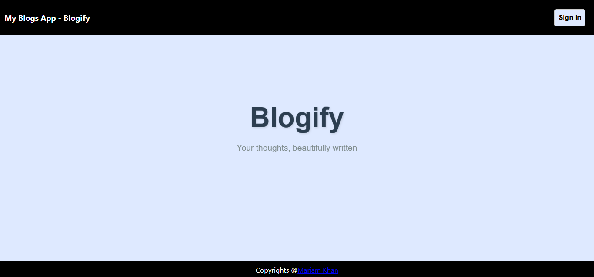
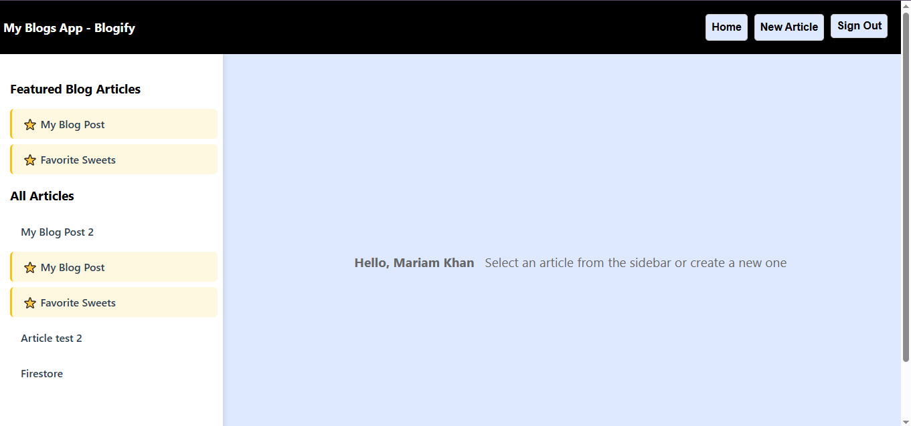
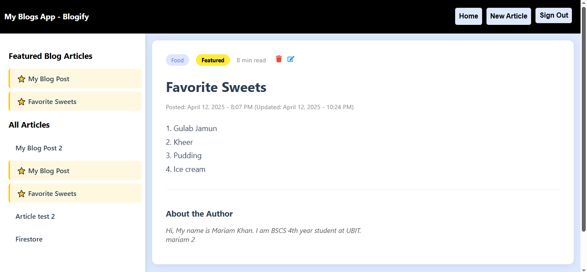
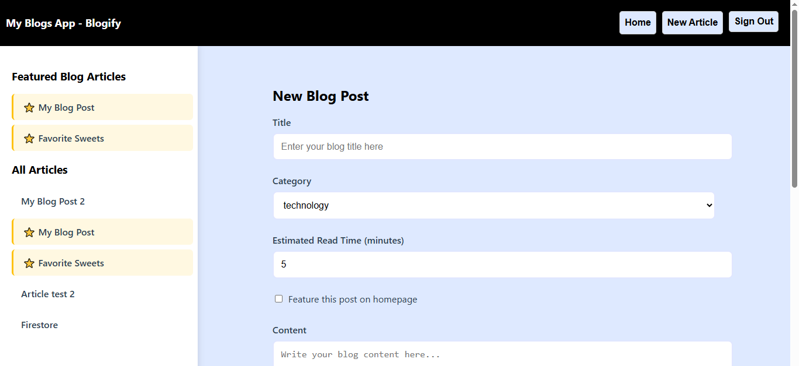

# **Blogify - Blog Article App**

## **Overview**
Blogify is a full-featured blog application built with React and Firebase that allows users to:

- Create, read, update, and delete blog articles
- Authenticate via Google Sign-In
- Manage articles with rich metadata
- Enjoy a responsive design across all devices

**For full experience check out: [App Link](https://my-firebase-app-b6c87.web.app/)**

  
    
  
  

## **Features**

### **Core Functionality:**

### **Authentication & Permissions**
- **Google Sign-In:** For authentication
- **Permission Rules:**
    - Read access for all authenticated users
    - Write access for authenticated users
    - Update/Delete only for article authors
    - Error messages for unauthorized actions

### **CRUD Operations**

- **Create:** Add new articles with all metadata
- **Read:** View articles with formatted dates and reading time
- **Update:** Edit existing articles (with updated timestamp)
- **Delete:** Remove articles with confirmation

### **Enhanced Form Fields**

- **Text Input:** For article titles
- **Select Dropdown:** For article categories (Technology, Lifestyle, Travel, Food, Health, Business)
- **Number Input:** For estimated read time (1-60 minutes)
- **Checkbox:** To mark articles as featured
- **Textarea:** For article content and author bio (with multi line ability)
- **Form Validation:** With error messages for required fields and invalid inputs

### **Navigation & UI**

- **Featured Articles Highlight:** Star icons (⭐) in navigation sidebar and at the top
- **Home Button:** Quick return to default homepage
- **User Info Display:** Shows currently logged in user
- **React Icons:** Used for edit/delete actions (FaEdit, FaTrash)
- **Welcome Screen:** Before user logs in
- **Responsive Design:** Works on mobile, tablet, and desktop

### **Deployment**
Hosted on Firebase using Firebase CLI

### **Technologies Used**

- **Frontend:** React.js
- **Styling:** CSS
- **Icons:** React Icons (Font Awesome)
- **Date Handling:** date-fns
- **Backend:** Firebase 
    - Authentication 
    - Firestore Database (Firestore)
    - Hosting

### **Installation**

1. Clone the Repository.
2. Install dependencies.
3. Set up Firebase
4. Run the application

### Author
**Mariam Khan**
### Contact

- **[linked In](www.linkedin.com/in/mariam-khan0424)**
- **[Email](khanmariam684@gmail.com)**